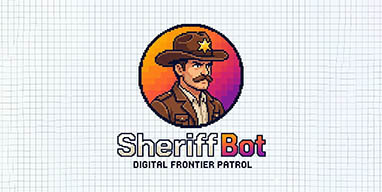
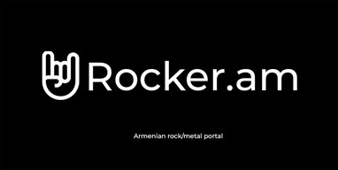
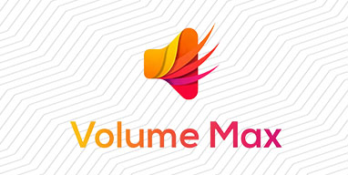
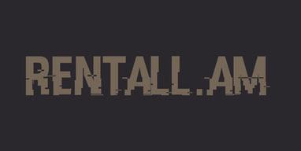

<div align="center">

<!-- HEADER WAVE -->


<!-- TYPING ANIMATION -->
<a href="https://github.com/mpetrosyan">
  
</a>
<br/>
<br/>
</div>

---

## 👨‍💻 About Me

```csharp
public class Developer
{
    public string Name     => "Mikayel Petrosyan";
    public string GitHub   => "github.com/mpetrosyan";
    public string Location => "Yerevan, Armenia 🇦🇲";

    public string[] Stack => new[] {
        "C#", "ASP.NET Core",
        "PHP", "Laravel", "Filament", "Livewire",
        "Vue 3", "Nuxt", "Inertia.js", "Redis", "MySQL"
    };

    public string[] CurrentlyBuilding => new[] { "SheriffBot", "Telegram Mini Apps" };

    public void DrinkCoffee()
    {
        while (true) 
        {
            Code();
        }
    }
}
```

---

##  Tech Stack

**Backend**


**Frontend**


**Database & Tools**


---

## Featured Projects

<div align="center">

<a href="https://github.com/mpetrosyan/sheriffbot">
  
</a>
&nbsp;
<a href="https://rocker.am">
  
</a>
&nbsp;
<a href="https://chromewebstore.google.com/detail/volume-max-sound-booster/kncgnhjkalclfiiffejefdjcmdgbcbfm">
  
</a>
&nbsp;
<a href="https://rentall.am"> 
  
</a>


</div>

---

<!-- FOOTER WAVE -->

