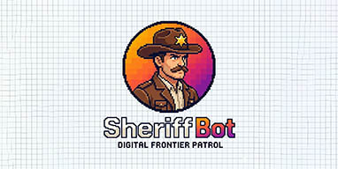
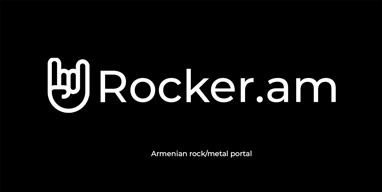
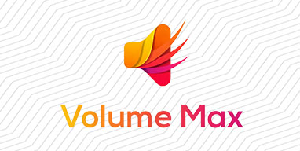
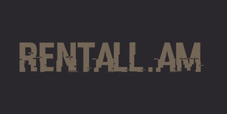

<div align="center">

<!-- HEADER WAVE -->


<!-- TYPING ANIMATION -->
<a href="https://mpetrosyan.info">

</a>
<br/>
<br/>
</div>

---

##  About Me

```php
<?php

class Developer
{
    public function getName(): string
    {
        return "Mikayel Petrosyan";
    }

    public function getGitHub(): string
    {
        return "github.com/m-petrosyan";
    }

    public function getLocation(): string
    {
        return "Yerevan, Armenia";
    }

    public function getStack(): array
    {
        return [
            "PHP", "Laravel", "Filament", "Livewire",
            "Vue 3", "Nuxt", "Inertia.js",
            "Node.js", "Nest.js",
            "Redis", "MySQL","PostgreSQL",
        ];
    }
}
```

---

##  Tech Stack

**Backend**


**Frontend**


**Database & Tools**


---

## Featured Projects

<div align="center">

<a href="https://t.me/BotSheriffBot">
  
</a>
&nbsp;
<a href="https://rocker.am">
  
</a>
&nbsp;
<a href="https://chromewebstore.google.com/detail/volume-max-sound-booster/kncgnhjkalclfiiffejefdjcmdgbcbfm">
  
</a>
&nbsp;
<a href="https://rentall.am"> 
  
</a>


</div>

---

##  CV Page (`/cv`) & auto PDF

The site has an editable **CV page at `/cv`** — press **Edit CV** on the page, change any field (profile, summary, experience, skills, languages, education, certifications) and every change is saved automatically to [`data/cv.json`](data/cv.json).

On every save the page also **regenerates `public/cv.pdf` automatically** (A4, print-friendly) and uploads it through the built-in API (`PUT /api/cv`, `PUT /api/cv/pdf`), so the “Download CV” links always serve the latest version.

> Note: generated `cv.pdf` is rendered from the browser (html2canvas + jspdf) — the “Download CV” button triggers it on first edit. The old one-page PDF in `public/cv.pdf` is kept until you edit.

**Securing edits (optional):** by default the edit API is open. To lock it, set the `CV_EDIT_KEY` environment variable on the server (e.g. in the pm2 ecosystem file). When set, the Edit dialog asks for that key before saving.

> If saving fails in production, make sure the server process (pm2 user) can write to `data/` and `public/`.


<!-- FOOTER WAVE -->

